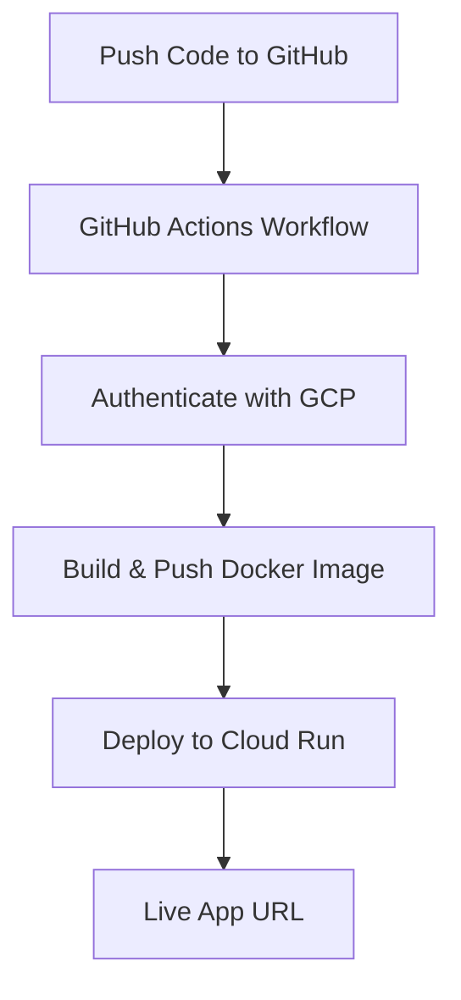

# insight-agent

# 🚀 Flask App Deployment to Google Cloud Run (Automated with GitHub Actions)

This project demonstrates how to **automatically deploy a Python Flask app** to **Google Cloud Run** using **GitHub Actions**.

## 📂 Project Structure
- `main.py` → The main Flask application.
- `requirements.txt` → Python dependencies.
- `Dockerfile` → Instructions for building the container image.
- `.github/workflows/deploy.yml` → GitHub Actions workflow for automated deployment.
- `.gitignore` → Files and folders excluded from version control.

## 🛠 Setup Instructions

### 1️⃣ Prerequisites
- A **Google Cloud Platform (GCP)** project.
- A **Service Account** with `Cloud Run Admin` and `Artifact Registry Writer` roles.
- GitHub repository access.

---

### 2️⃣ Create & Download Service Account Key
1. Go to **GCP Console → IAM & Admin → Service Accounts**.
2. Create a new service account.
3. Assign these roles:
   - `Cloud Run Admin`
   - `Artifact Registry Writer`
   - `Service Account User`
4. Create a **JSON key** and download it.

---

### 3️⃣ Add GitHub Secrets
In your GitHub repo:
- Go to **Settings → Secrets and variables → Actions → New repository secret**.
- Add:
  - `GCP_CREDENTIALS` → Paste the entire JSON key here.
  - `GCP_PROJECT_ID` → Your GCP project ID.
  - `GCP_REGION` → e.g., `us-central1`.
- Add the same credentials inside `deploy.yml` in the insert sections to much the ones you have provided above
---

### 4️⃣ Deploy Automatically
- Push any commit to the `main` branch.
- GitHub Actions will:
  1. Build the Docker image.
  2. Push it to **Google Artifact Registry**.
  3. Deploy it to **Cloud Run**.

---

## 📌 Notes
- This repo **will not deploy** unless you add the required GitHub Secrets.
- The provided workflow can be adapted for any Python app.
- The example app here is a minimal `"Hello from Cloud Run!"` Flask service.

---

## 📸 Example Deployment Flow

## 🙌 Contributing
Pull requests are welcome. Let’s use tech to make a difference 💪.

## 📫 Contact
Made with purpose by Luke Mbogo.
Reach out: Lukembog5@gmail.com
